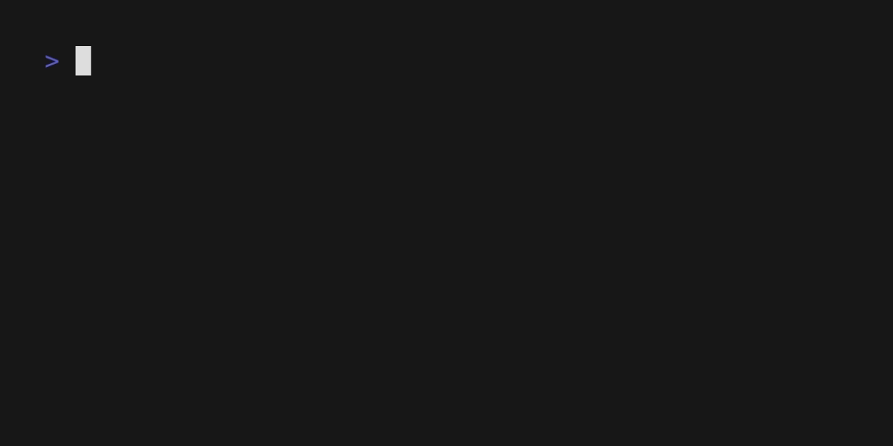

<!-- Code generated by gomarkdoc. DO NOT EDIT -->

# awesomeDSL

awesomeDSL is a simple DSL, which helps you build your own bot. support basic data types, such as integer, boolean, string, array have builtin functions, such as len, first, last, rest, push support user defined function support if\-else statement support user defined function Example for a simple program:

```
let hello = puts("hello world");
let a = 1;
let b = 2;
let add = fn(x, y) {
	x + y;
};
let result = add(a, b);
let tellmeresult= if result > 0 {
	puts("result is positive");
} else {
	puts("result is negative");
};
```


## Index
[Lexer](./doc/lexer.md)

[Parser](./doc/parser.md)

[Evaluator](./doc/evaluator.md)

[Token](./doc/token.md)

[Ast](./doc/ast.md)

[Object](./doc/object.md)

[TUI](./doc/tui.md)

[Repl](./doc/repl.md)

[Gpt](./doc/gpt.md)


## Quick Start
`go build main.go`

`./main <your_script.txt>`

Generated by [gomarkdoc](<https://github.com/princjef/gomarkdoc>)
